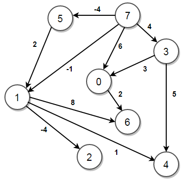
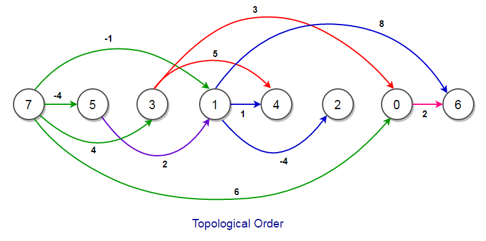

# Lecture 20: Bellman-Ford Algorithm for Shortest Paths

>Note: The most of the information of these lectures was extracted and adapted from Dr Bajuelos and from Weiss’s book, “Data Structures and Algorithm Analysis in Java". They are provided for COP3530 students only. Not to be published or publicly distributed without permission by the publisher. 

## Definition

The Bellman–Ford algorithm is an algorithm that computes shortest paths from a single source vertex to all of the other vertices in a weighted digraph.

It is slower than Dijkstra's algorithm for the same problem, but more versatile, as it is capable of handling graphs in which some of the edge weights are negative numbers.

### Single-Source Shortest-Path (SP) Problem.

* Given a weighted graph, G = (V,E), and a distinguished vertex, s, find the shortest weighted path from s to every other vertex in G.

The Problem (adaptation for the Djikstra’s Algorithm): 

* Given a digraph with non-negative edge weights, G=(V,E), and a distinguished source vertex <b>s</b> in V. 
* Determine the distance and a shortest path (SP) from the source vertex to every vertex in the digraph.

Bellman-Ford algorithm: more general than Dijkstra’s algorithm for shortest path problem: 
* Edge-weights can be negative
* Detects the existence of negative-weight cycle(s) reachable from s.

### Relaxation

Lemma 1: Let p<sub>1k</sub> = ‹v<sub>1</sub>, v<sub>2</sub>, …, v<sub>k</sub>› be a SP from v<sub>1</sub> to v<sub>k</sub>.  Then p<sub>ij</sub> = ‹v<sub>1i</sub>, v<sub>i+1</sub>, …, v<sub>j</sub>› is a SP from v<sub>i</sub> to v<sub>j</sub>, where 1 <= i <= j <= k. 

So, for shortest path problem we have the optimal-substructure property.


Let δ(u,v) = weight of SP from u to v.
* Corollary: Let p = SP from s to v. 
	* Then, δ(s,v) = δ(s,u)  + w(u,v)

Lemma 2: (Triangle inequality) Let s ∈ V. 
* For all edges (u,v) ∈ E, we have:
	δ(s,v) <= δ(s,u) + w(u,v)

Algorithms keep track of d[v], π[v].  
Initialized as follows (pseudocode):
```text
Initialize(G,s)

for each v ∈ V
{
	d[v] = ∞;
	π[v] := NIL;
}
d[s] = 0;

```
These values are changed when an edge (u,v) is relaxed:
```text
Relax(u,v,w)
if d[v] > d[u] + w(u,v) then
{
    d[v] = d[u] + w(u,v);
	π[v] = u;
}

```
### Properties of Relaxation


* d[v], if not ∞, is the length of some path from s to v.
* d[v] either stays the same or decreases with time.
* Therefore, if d[v] = δ(s, v) at any time, this holds thereafter.
* d[v] >= δ(s, v) always.


## BellMan-Ford Algorithm

The input graph can have negative-weight edges.  

```text
// Initialize the values
Initialize(G, s);

// Run the relaxation algorithm
for i = 1 to |V| –1 
{
	for each (u,v) in E 
	{
		Relax(u,v,w)
    }
};

//Detect the existence of negative-weight cycle(s) reachable from s.

for each (u,v) in E 
{ 
	if d[v] > d[u] + w(u,v)
    {
        error("Graph contains cycles of negative length");
		return false
	}
}
return true
```

Complexity: - O(\|V\|\|E\|)


Example:

http://www.programming-algorithms.net/article/47389/Bellman-Ford-algorithm

Visualization:

https://visualgo.net/en/sssp

Java Implementation:

http://algs4.cs.princeton.edu/44sp/BellmanFordSP.java.html

## Example:

https://www.techiedelight.com/single-source-shortest-paths-bellman-ford-algorithm/

### Implementation

```java
import java.util.ArrayList;
import java.util.Arrays;
import java.util.List;
 
// A class to store a graph edge
class Edge
{
    int source, dest, weight;
 
    public Edge(int source, int dest, int weight)
    {
        this.source = source;
        this.dest = dest;
        this.weight = weight;
    }
}
 
class Main
{
    // Recursive function to print the path of a given vertex from source vertex
    static void getPath(int parent[], int vertex, List<Integer> path)
    {
        if (vertex < 0) {
            return;
        }
 
        getPath(parent, parent[vertex], path);
        path.add(vertex);
    }
 
    // Function to run the Bellman–Ford algorithm from a given source
    public static void bellmanFord(List<Edge> edges, int source, int n)
    {
        // distance[] and parent[] stores the shortest path
        // (least cost/path) information
        int distance[] = new int[n];
        int parent[] = new int[n];
 
        // initialize `distance[]` and `parent[]`. Initially, all vertices
        // except source vertex weight INFINITY and no parent
        Arrays.fill(distance, Integer.MAX_VALUE);
        distance[source] = 0;
 
        Arrays.fill(parent, -1);
 
        // relaxation step (run V-1 times)
        for (int i = 0; i < n - 1; i++)
        {
            for (Edge edge: edges)
            {
                // edge from `u` to `v` having weight `w`
                int u = edge.source;
                int v = edge.dest;
                int w = edge.weight;
 
                // if the distance to destination `v` can be
                // shortened by taking edge (u, v)
                if (distance[u] != Integer.MAX_VALUE && distance[u] + w < distance[v])
                {
                    // update distance to the new lower value
                    distance[v] = distance[u] + w;
 
                    // set v's parent as `u`
                    parent[v] = u;
                }
            }
        }
 
        // run relaxation step once more for n'th time to
        // check for negative-weight cycles
        for (Edge edge: edges)
        {
            // edge from `u` to `v` having weight `w`
            int u = edge.source;
            int v = edge.dest;
            int w = edge.weight;
 
            // if the distance to destination `u` can be
            // shortened by taking edge (u, v)
            if (distance[u] != Integer.MAX_VALUE && distance[u] + w < distance[v])
            {
                System.out.println("Negative-weight cycle is found!!");
                return;
            }
        }
 
        for (int i = 0; i < n; i++)
        {
            if (i != source && distance[i] < Integer.MAX_VALUE) {
                List<Integer> path = new ArrayList<>();
                getPath(parent, i, path);
                System.out.println("The distance of vertex " + i + " from vertex " +
                        source + " is " + distance[i] + ". Its path is " + path);
            }
        }
    }
 
    public static void main(String[] args)
    {
        // List of graph edges as per the above diagram
        List<Edge> edges = Arrays.asList(
                // (x, y, w) —> edge from `x` to `y` having weight `w`
                new Edge(0, 1, -1), new Edge(0, 2, 4), new Edge(1, 2, 3),
                new Edge(1, 3, 2), new Edge(1, 4, 2), new Edge(3, 2, 5),
                new Edge(3, 1, 1), new Edge(4, 3, -3 )
        );
 
        // set the maximum number of nodes in the graph
        int n = 5;
 
        // run the Bellman–Ford algorithm from every node
        for (int source = 0; source < n; source++) {
            bellmanFord(edges, source, n);
        }
    }
}
```


## Class Problem

Given a weighted directed acyclic graph (DAG) and a source vertex, find the shortest path’s cost from the source vertex to all other vertices present in the graph. If the vertex can’t be reached from the given source vertex, return its distance as infinity.

For example, consider the following DAG:




The shortest distance of source vertex 7 to every other vertex is:
```
dist(7, 0) =  6 (7 —> 0)
dist(7, 1) = -2 (7 —> 5 —> 1)
dist(7, 2) = -6 (7 —> 5 —> 1 —> 2)
dist(7, 3) =  4 (7 —> 3)
dist(7, 4) = -1 (7 —> 5 —> 1 —> 4)
dist(7, 5) = -4 (7 —> 5)
dist(7, 6) =  6 (7 —> 5 —> 1 —> 6)
```

We know that a Topological sort of a directed acyclic graph is a linear ordering of its vertices such that for every directed edge uv from vertex u to vertex v, u comes before v in the ordering.



We can use a topological sort to solve this problem. When we consider a vertex u in topological order, it is guaranteed that we have considered every incoming edge to it. 

Now for each vertex v of the DAG in the topological order, we relax the cost of its outgoing edges (update the shortest path information). 

In order words, since we have already found the shortest path to vertex v, we can use that info to update the shortest path of all its adjacent vertices, i.e.,

```
for each vertex u in topological order
    for each edge (u, v) with weight w
        if (distance[u] + w < distance[v])
            distance[v] = distance[u] + w
```

### Answer

```java

import java.util.ArrayList;
import java.util.Arrays;
import java.util.List;
 
// A class to store a graph edge
class Edge
{
    int source, dest, weight;
 
    public Edge(int source, int dest, int weight)
    {
        this.source = source;
        this.dest = dest;
        this.weight = weight;
    }
}
 
// A class to represent a graph object
class Graph
{
    // A list of lists to represent an adjacency list
    List<List<Edge>> adjList = null;
 
    // Constructor
    Graph(List<Edge> edges, int n)
    {
        adjList = new ArrayList<>();
 
        for (int i = 0; i < n; i++) {
            adjList.add(new ArrayList<>());
        }
 
        // add edges to the directed graph
        for (Edge edge: edges) {
            adjList.get(edge.source).add(edge);
        }
    }
}
 
class Main
{
    // Perform DFS on the graph and set the departure time of all
    // vertices of the graph
    private static int DFS(Graph graph, int v, boolean[] discovered,
                           int[] departure, int time)
    {
        // mark the current node as discovered
        discovered[v] = true;
 
        // set arrival time – not needed
        // time++;
 
        // do for every edge (v, u)
        for (Edge edge: graph.adjList.get(v))
        {
            int u = edge.dest;
 
            // if `u` is not yet discovered
            if (!discovered[u]) {
                time = DFS(graph, u, discovered, departure, time);
            }
        }
 
        // ready to backtrack
        // set departure time of vertex `v`
        departure[time] = v;
        time++;
 
        return time;
    }
 
    // The function performs the topological sort on a given DAG and then finds
    // the longest distance of all vertices from a given source by running one pass
    // of the Bellman–Ford algorithm on edges or vertices in topological order
    public static void findShortestDistance(Graph graph, int source, int n)
    {
        // departure[] stores the vertex number using departure time as an index
        int[] departure = new int[n];
        Arrays.fill(departure, -1);
 
        // to keep track of whether a vertex is discovered or not
        boolean[] discovered = new boolean[n];
        int time = 0;
 
        // perform DFS on all undiscovered vertices
        for (int i = 0; i < n; i++)
        {
            if (!discovered[i]) {
                time = DFS(graph, i, discovered, departure, time);
            }
        }
 
        int[] cost = new int[n];
        Arrays.fill(cost, Integer.MAX_VALUE);
 
        cost[source] = 0;
 
        // Process the vertices in topological order, i.e., in order
        // of their decreasing departure time in DFS
        for (int i = n - 1; i >= 0; i--)
        {
            // for each vertex in topological order,
            // relax the cost of its adjacent vertices
            int v = departure[i];
            for (Edge e: graph.adjList.get(v))
            {
                // edge `e` from `v` to `u` having weight `w`
                int u = e.dest;
                int w = e.weight;
 
                // if the distance to destination `u` can be shortened by
                // taking edge (v, u), update cost to the new lower value
                if (cost[v] != Integer.MAX_VALUE && cost[v] + w < cost[u]) {
                    cost[u] = cost[v] + w;
                }
            }
        }
 
        // print shortest paths
        for (int i = 0; i < n; i++) {
            System.out.printf("dist(%d, %d) = %2d\n", source, i, cost[i]);
        }
    }
 
    public static void main(String[] args)
    {
        // List of graph edges as per the above diagram
        List<Edge> edges = Arrays.asList(
                new Edge(0, 6, 2), new Edge(1, 2, -4), new Edge(1, 4, 1),
                new Edge(1, 6, 8), new Edge(3, 0, 3), new Edge(3, 4, 5),
                new Edge(5, 1, 2), new Edge(7, 0, 6), new Edge(7, 1, -1),
                new Edge(7, 3, 4), new Edge(7, 5, -4)
        );
 
        // total number of nodes in the graph (labelled from 0 to 7)
        int n = 8;
 
        // build a graph from the given edges
        Graph graph = new Graph(edges, n);
 
        // source vertex
        int source = 7;
 
        // find the shortest distance of all vertices from the given source
        findShortestDistance(graph, source, n);
    }
}
```
